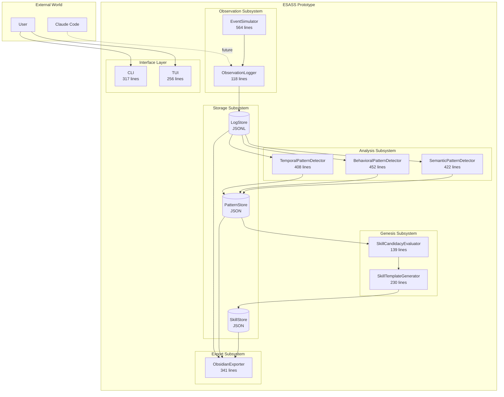
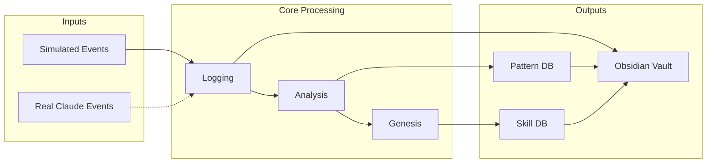
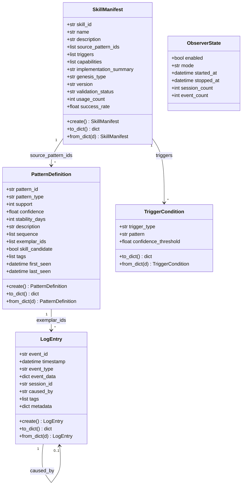
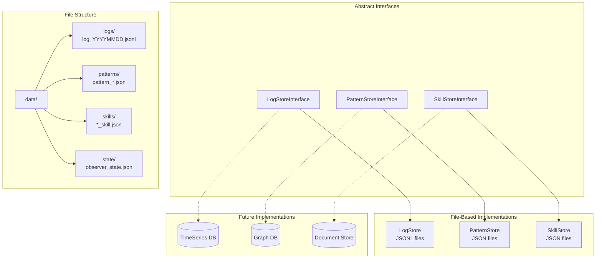
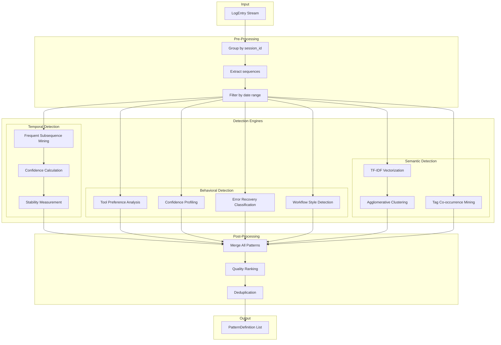
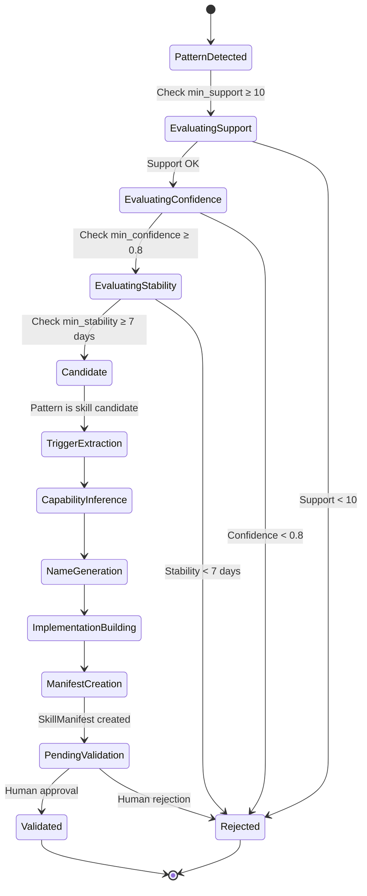
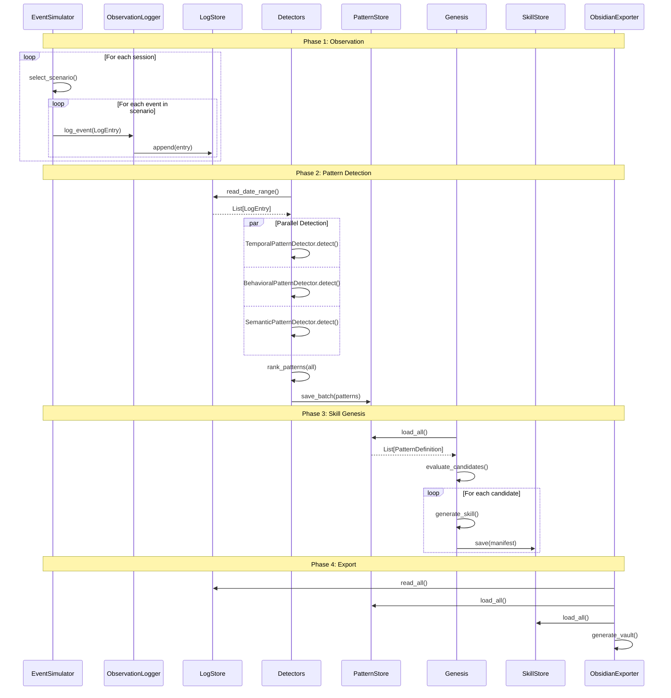
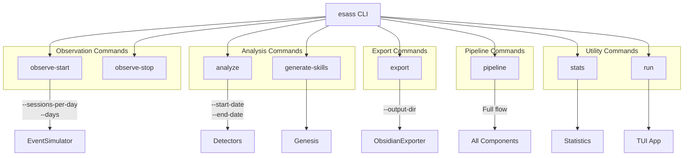
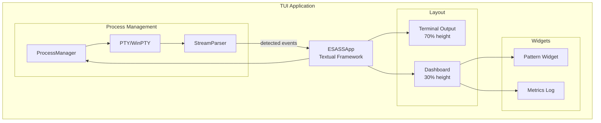
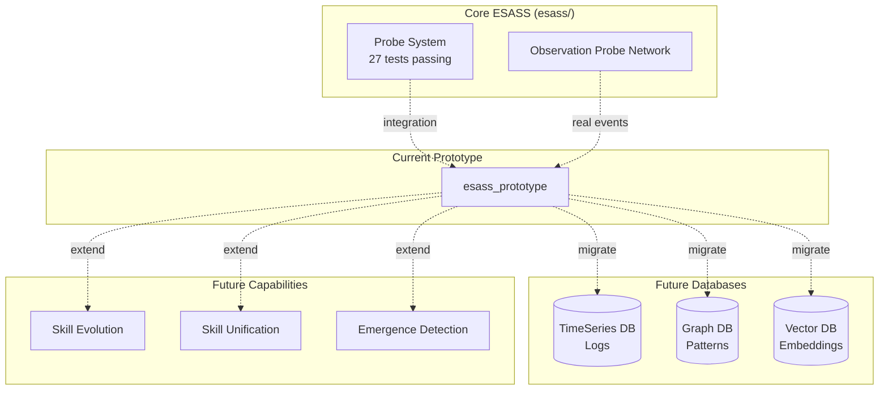

# ESASS Prototype Architecture

Detailed architecture documentation with visual diagrams.

## High-Level Architecture



## Component Interaction Diagram



## Data Model Relationships



## Storage Layer Design



## Pattern Detection Architecture



## Skill Genesis Pipeline



## Event Flow Through System



## CLI Command Structure



## TUI Architecture



## Configuration Hierarchy

```mermaid
graph TD
    subgraph "ESASSConfig"
        direction TB
        OC[ObservationConfig]
        SC[StorageConfig]
        PDC[PatternDetectionConfig]
        SGC[SkillGenerationConfig]
        EC[ExportConfig]
        PSC[ProbeSystemConfig]
    end

    subgraph "ObservationConfig"
        O1[mode: simulation|live]
        O2[sessions_per_day: 20]
        O3[days: 14]
    end

    subgraph "StorageConfig"
        S1[data_dir: ./data]
        S2[log_format: jsonl]
        S3[retention_days: 90]
    end

    subgraph "PatternDetectionConfig"
        P1[min_support: 10]
        P2[min_confidence: 0.8]
        P3[min_stability_days: 7]
        P4[max_gap_seconds: 300]
    end

    subgraph "SkillGenerationConfig"
        G1[auto_generate: false]
        G2[require_validation: true]
    end

    subgraph "ExportConfig"
        E1[obsidian_vault: ./vault]
        E2[export_format: markdown]
    end

    OC --> O1 & O2 & O3
    SC --> S1 & S2 & S3
    PDC --> P1 & P2 & P3 & P4
    SGC --> G1 & G2
    EC --> E1 & E2
```

## Quality Metrics Flow

```mermaid
graph LR
    subgraph "Raw Metrics"
        SUP[Support<br/>count of occurrences]
        CONF[Confidence<br/>P(full|first)]
        STAB[Stability<br/>day span]
    end

    subgraph "Calculated Metrics"
        LIFT[Lift<br/>observed/expected]
        COH[Coherence<br/>internal consistency]
        DIST[Distinctiveness<br/>uniqueness score]
    end

    subgraph "Composite Score"
        RANK[Quality Score<br/>support×0.4 + conf×0.3 + stab×0.3]
    end

    subgraph "Candidacy Thresholds"
        T1[support ≥ 10]
        T2[confidence ≥ 0.8]
        T3[stability ≥ 7 days]
    end

    SUP --> LIFT
    CONF --> COH
    STAB --> DIST

    SUP & CONF & STAB --> RANK
    RANK --> T1 & T2 & T3
```

## Future Integration Points



## Code Metrics Summary

| Module | Lines | Purpose |
|--------|-------|---------|
| `models.py` | 402 | Core data models |
| `config.py` | 109 | Configuration |
| `cli.py` | 317 | CLI interface |
| `observation/simulator.py` | 563 | Event simulation |
| `observation/logger.py` | 117 | Logging |
| `storage/interfaces.py` | 223 | ABC contracts |
| `storage/log_store.py` | 177 | Log storage |
| `storage/pattern_store.py` | 146 | Pattern storage |
| `storage/skill_store.py` | 170 | Skill storage |
| `analysis/pattern_detector.py` | 407 | Temporal detection |
| `analysis/behavioral_detector.py` | 451 | Behavioral detection |
| `analysis/semantic_detector.py` | 421 | Semantic detection |
| `analysis/metrics.py` | 84 | Quality scoring |
| `genesis/candidate.py` | 138 | Candidacy evaluation |
| `genesis/template.py` | 229 | Template generation |
| `export/obsidian.py` | 340 | Obsidian export |
| `tui/app.py` | 95 | TUI application |
| `tui/parser.py` | 50 | Stream parsing |
| `tui/process.py` | 108 | PTY management |
| **Total** | **4,624** | Clean, documented Python |
