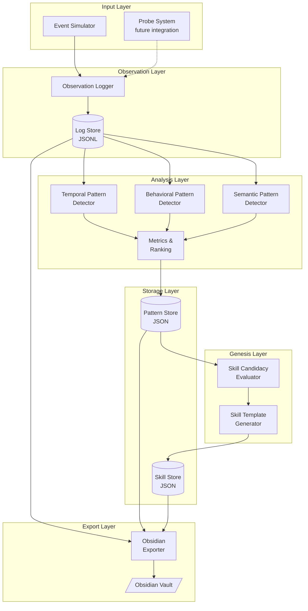
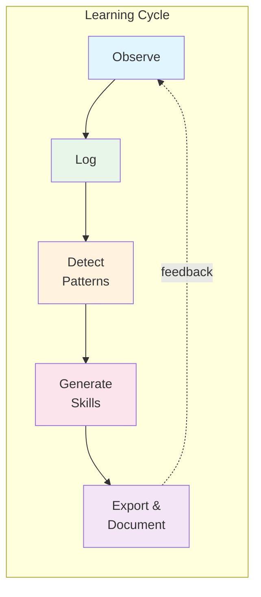
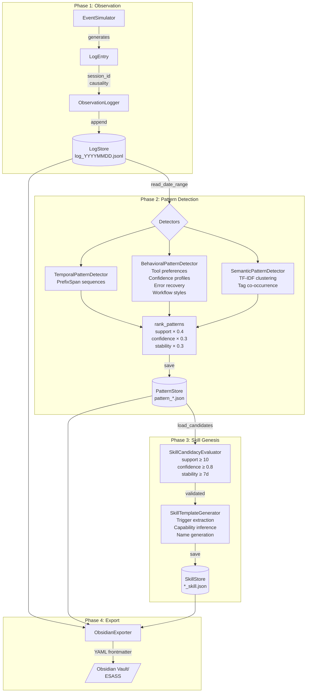
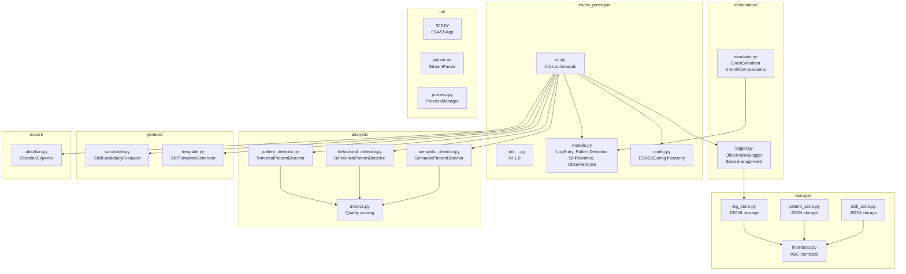
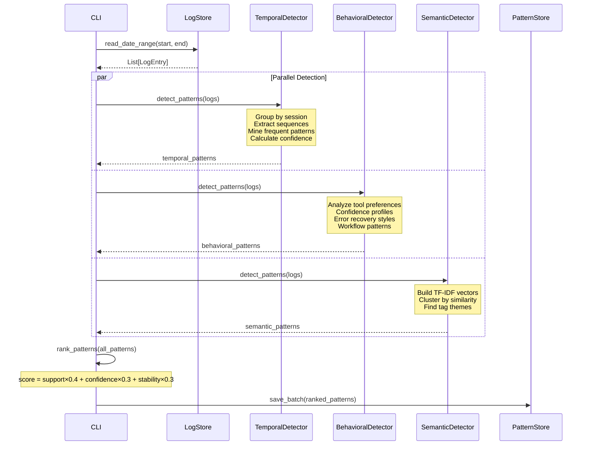
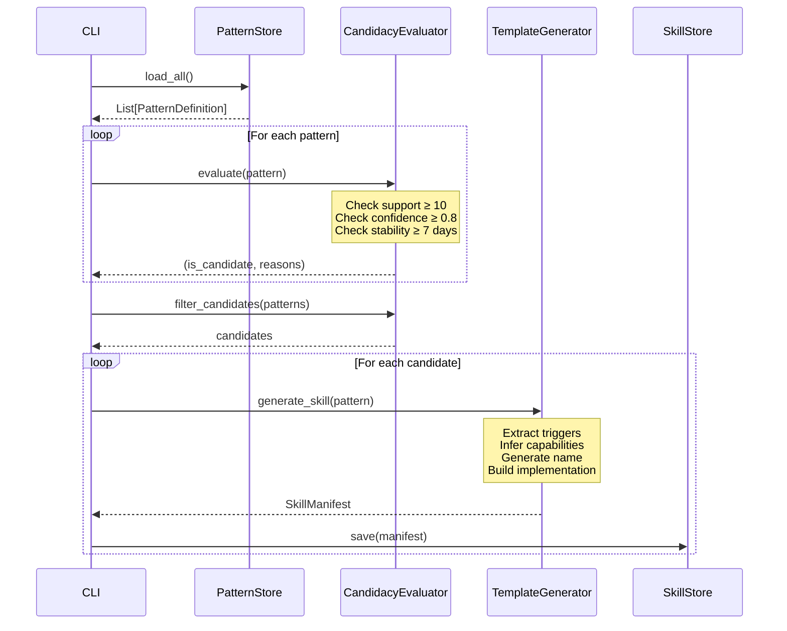
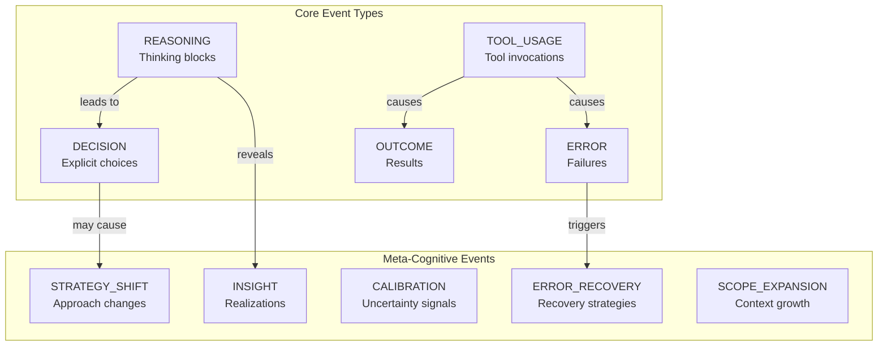
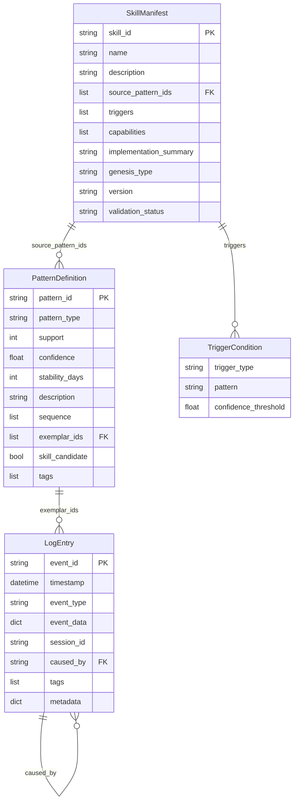

# ESASS Prototype

**Emergent Self-Adaptive Skill System** - A meta-cognitive architecture for AI skill learning

[]()
[]()
[]()

## Overview

The ESASS Prototype implements the core meta-cognitive learning loop that transforms implicit usage patterns into explicit, composable skill definitions. This standalone prototype demonstrates:

- **Observation**: Capture and log execution events
- **Pattern Detection**: Identify recurring temporal, behavioral, and semantic patterns
- **Skill Genesis**: Convert validated patterns into skill manifests
- **Export**: Generate documentation for Obsidian vaults

## Architecture

### System Overview



### The Meta-Cognitive Loop



### Data Flow Architecture



### Module Architecture



### Pattern Detection Pipeline



### Skill Genesis Pipeline



### Event Type Hierarchy



### Storage Schema



## Installation

```bash
# Navigate to prototype directory
cd esass_prototype

# Install dependencies
pip install -e ".[dev]"

# Or install requirements directly
pip install click textual
```

## Usage

### CLI Commands

```bash
# Generate simulated observation data
esass observe-start --sessions-per-day 20 --days 14

# Stop observation
esass observe-stop

# Analyze patterns from logs
esass analyze --start-date 2026-01-01 --end-date 2026-01-31

# Generate skills from patterns
esass generate-skills

# Export to Obsidian vault
esass export --output-dir ./vault

# Run full pipeline
esass pipeline --sessions-per-day 20 --days 14

# View system statistics
esass stats

# Launch TUI (experimental)
esass run
```

### Programmatic Usage

```python
from esass_prototype.config import ESASSConfig
from esass_prototype.observation.simulator import EventSimulator
from esass_prototype.observation.logger import ObservationLogger
from esass_prototype.storage.log_store import LogStore
from esass_prototype.analysis.pattern_detector import TemporalPatternDetector
from esass_prototype.genesis.candidate import SkillCandidacyEvaluator
from esass_prototype.genesis.template import SkillTemplateGenerator

# Initialize
config = ESASSConfig()
log_store = LogStore(config.storage.data_dir)
logger = ObservationLogger(log_store, config.storage.data_dir)

# Generate synthetic events
simulator = EventSimulator()
for session in simulator.generate_session_batch(20, 14):
    for event in session:
        logger.log_event(event)

# Detect patterns
detector = TemporalPatternDetector(
    min_support=config.pattern_detection.min_support,
    min_confidence=config.pattern_detection.min_confidence
)
logs = log_store.read_all()
patterns = detector.detect_patterns(logs)

# Evaluate candidates
evaluator = SkillCandidacyEvaluator(
    min_support=config.pattern_detection.min_support,
    min_confidence=config.pattern_detection.min_confidence,
    min_stability_days=config.pattern_detection.min_stability_days
)
candidates = evaluator.filter_candidates(patterns)

# Generate skills
generator = SkillTemplateGenerator()
for pattern in candidates:
    skill = generator.generate_skill(pattern)
    print(f"Generated: {skill.name}")
```

## Directory Structure

```
esass_prototype/
├── __init__.py                 # Package metadata (v0.1.0)
├── models.py                   # Core data models (402 lines)
├── config.py                   # Configuration management (109 lines)
├── cli.py                      # Click CLI interface (317 lines)
│
├── observation/                # Event capture
│   ├── logger.py               # State & event logging (117 lines)
│   └── simulator.py            # Synthetic event generation (563 lines)
│
├── storage/                    # Persistence layer
│   ├── interfaces.py           # Abstract contracts (223 lines)
│   ├── log_store.py            # JSONL log storage (177 lines)
│   ├── pattern_store.py        # JSON pattern storage (146 lines)
│   └── skill_store.py          # JSON skill storage (170 lines)
│
├── analysis/                   # Pattern detection
│   ├── pattern_detector.py     # Temporal sequences (407 lines)
│   ├── behavioral_detector.py  # Behavioral styles (451 lines)
│   ├── semantic_detector.py    # Semantic clustering (421 lines)
│   └── metrics.py              # Quality scoring (84 lines)
│
├── genesis/                    # Skill generation
│   ├── candidate.py            # Candidacy evaluation (138 lines)
│   └── template.py             # Manifest generation (229 lines)
│
├── export/                     # Output formatters
│   └── obsidian.py             # Obsidian vault export (340 lines)
│
└── tui/                        # Terminal UI (253 lines total)
    ├── app.py                  # Textual application (95 lines)
    ├── parser.py               # Stream parsing (50 lines)
    └── process.py              # PTY management (108 lines)
```

## Configuration

### Default Thresholds

| Parameter | Value | Description |
|-----------|-------|-------------|
| `min_support` | 10 | Minimum pattern occurrences |
| `min_confidence` | 0.8 | Minimum pattern confidence |
| `min_stability_days` | 7 | Days pattern must persist |
| `max_gap_seconds` | 300 | Max time between sequence events |

### Pattern Detection Thresholds by Type

| Detector | min_support | min_confidence | min_stability |
|----------|-------------|----------------|---------------|
| Temporal | 10 | 0.8 | 7 days |
| Behavioral | 5 | 0.6 | 3 days |
| Semantic | 5 | 0.6 | 3 days |

## Pattern Types

### Temporal Patterns
Recurring event sequences detected via simplified PrefixSpan algorithm:
- Git workflows: `TOOL_USAGE[git status] → DECISION → TOOL_USAGE[git commit]`
- Analysis chains: `REASONING → TOOL_USAGE[grep] → REASONING → DECISION`

### Behavioral Patterns
Usage style tendencies:
- **Tool preferences**: Tools appearing in >60% of sessions
- **Confidence profiles**: High/low/stable confidence per event type
- **Error recovery**: retry_same_tool, pivot_to_different_tool, analyze_then_act
- **Workflow styles**: analyze_first, execution_first, deep_analysis_first

### Semantic Patterns
Conceptual clustering via TF-IDF and tag co-occurrence:
- Topic themes: testing, documentation, debugging
- Concept associations: "git" + "commit" + "status"

## Obsidian Export

The exporter generates a structured vault:

```
ESASS/
├── README.md           # Index with statistics
├── logs/               # Daily summaries
│   └── 2026-01-15.md   # YAML frontmatter + event breakdown
├── patterns/           # Pattern documentation
│   └── pattern_abc.md  # Metrics, sequence, exemplars
└── skills/             # Skill manifests
    └── git_skill.md    # Triggers, capabilities, implementation
```

Each file includes YAML frontmatter for Obsidian properties and internal `[[wiki-links]]` for cross-referencing.

## Simulation Scenarios

The EventSimulator models 5 realistic Claude Code workflows:

1. **Git Workflow**: status → diff → decision → add → commit
2. **Code Analysis**: reasoning → glob → read → reasoning → decision
3. **Bug Fix**: reasoning → grep → read → diagnosis → edit → test
4. **Documentation**: reasoning → read → decision → edit → review
5. **Test Writing**: reasoning → read → decision → write → test → verify

## Implementation Status

| Component | Status | Notes |
|-----------|--------|-------|
| Event Simulation | ✅ Complete | 5 workflow scenarios |
| Log Storage | ✅ Complete | JSONL, append-only |
| Pattern Storage | ✅ Complete | JSON, searchable |
| Skill Storage | ✅ Complete | JSON, versioned |
| Temporal Detection | ✅ Complete | PrefixSpan-like |
| Behavioral Detection | ✅ Complete | 4 behavior types |
| Semantic Detection | ✅ Complete | TF-IDF clustering |
| Skill Candidacy | ✅ Complete | §6.2 criteria |
| Skill Generation | ✅ Complete | Template-based |
| Obsidian Export | ✅ Complete | YAML frontmatter |
| CLI | ✅ Complete | 8 commands |
| TUI | ✅ Complete | Textual-based |
| Probe Integration | ⏳ Planned | See esass/probes/ |
| Graph Database | ⏳ Planned | Pattern relationships |
| Vector Database | ⏳ Planned | Semantic embeddings |
| Skill Evolution | ⏳ Planned | ABSORB, MERGE, etc. |

## Related Documentation

- [ESASS Specification](../esass-specification_v0.01.md) - Complete system specification
- [Architecture](../ARCHITECTURE.md) - Detailed architecture design
- [CLAUDE.md](../CLAUDE.md) - Development guidelines
- [Probe System](../esass/probes/README.md) - Event capture probes

## License

See repository root for license information.
